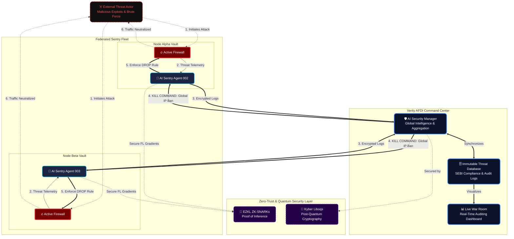

# 🛡️ Verity AFDI: Auditable AI-Federated Defense Interface

**Verity** is a decentralized **Auditable Federated Learning (AFL)** Intrusion Detection & Active Response System (IDARS) designed for high-compliance financial environments. It deploys a fleet of "AI Sentry Nodes" that protect critical infrastructure by detecting threats and autonomously executing firewall bans. Unlike standard federated networks, Verity integrates an **Active Defense** layer that autonomously detects threats and executes firewall bans across distributed nodes.

---

<p align="center">
  
  
  
  
  
  
</p>

---

## 📜 Regulatory Compliance & Audit Readiness

> **Regulatory Compliance:** This architecture addresses **SEBI's 2025 AI Responsibility Framework** requirements for "comprehensive internal approval trails" and "system-level records". By enforcing immutable logs of all automated defense decisions, Verity ensures that AI-driven active responses remain transparent, traceable, and fully auditable.

*Aligned with SEBI AI/ML Responsibility Framework (Dec 2024)*

This system is designed not just for security, but for **auditable governance** required by financial regulators.

| Requirement | Implementation in AEGIS-OVERWATCH |
| :--- | :--- |
| **Audit Trails** | Full immutable logs of every security event (Wazuh Archives). |
| **Active Defense** | Automated `iptables` bans providing evidence of threat neutralization. |
| **Federated Privacy** | Gradient-only sharing ensures raw financial data never leaves the node. |
| **Incident Reporting** | Centralized Dashboard (Port 443) for real-time regulator visibility. |

---

## 🛠️ The Technology Stack
| Layer | Technology | Role |
| :--- | :--- | :--- |
| **Cognitive Engine** | PyTorch + Flower (FL) | Federated Learning across distributed nodes. |
| **Assurance Layer** | LangGraph Agent | Autonomous threat detection and response. |
| **Trust Layer** | EZKL / ZK-SNARKs | Proof of Inference & Validity. |
| **Integrity Monitor** | Wazuh (SIEM) | Enterprise-grade endpoint security monitoring. |
| **Defense Layer** | Liboqs (Kyber) | NIST-Standard Post-Quantum Cryptography. |
| **Infrastructure** | Docker + Linux | Containerized, secure, and portable. |

---

## 🛡️ Attack Simulation & Verification
The system includes a custom penetration testing script (`attack_fleet.sh`) to validate defense readiness.

### How to Run a Live Fire Test
```bash
# 1. Launch the coordinated attack simulation
./attack_fleet.sh

# 2. Watch the Active Response in real-time
docker exec -u 0 zombie_node iptables -L INPUT -n
```
## 🏗️ Architecture (Level 3: Federated Grid)


The system consists of a Central Command (The Brain) and Distributed Sentries (The Edge).


    
    # verity-afdi-1.0
VERITY: A Self-Healing, Privacy-Preserving Autonomous Financial Defense Infrastructure (AFDI). Built with Federated Learning, Post-Quantum Cryptography, and Agentic Security.

# VERITY 🕊️
### **Autonomous Financial Defense Infrastructure (AFDI)**

> **"Restoring Trust through Mathematical Certainty and Autonomous Resilience."**

VERITY is a frontier-grade **AFDI** (Autonomous Financial Defense Infrastructure) designed for the post-quantum era. It enables financial institutions to collaborate on intelligence (Federated Learning) while maintaining absolute privacy (Zero-Knowledge) and defending against real-time threats via an autonomous security agent.

---

## 🚀 The Vision
In a world where data privacy laws (GDPR) and quantum computing threats are colliding, traditional financial systems are failing. **VERITY** solves this by:
1. **Never Touching Raw Data:** Training AI locally across nodes.
2. **Proving Truth:** Using ZK-Proofs to verify calculations without seeing the data.
3. **Self-Healing:** An autonomous "Assurance Agent" that blocks attackers in milliseconds.

---

## 🏗️ Architecture: The Self-Defending Node
Every VERITY node is a **"Protected Vault"**:
* **The Brain:** Executes financial AI models on local data.
* **The Angel:** A Sentinel process that watches logs and acts as a firewall.
* **The Monitor:** Reports security telemetry to a central "God Mode" Dashboard.

---

## 🚦 Getting Started (Cloud Deployment)

### **Prerequisites**
This project is designed to run in **GitHub Codespaces** to ensure high-performance Linux compatibility.

1. **Launch:** Open this repo in GitHub Codespaces.
2. **Setup:** ```bash
   sudo sysctl -w vm.max_map_count=262144
   cd infrastructure
   docker-compose up --build


## 🔮 Future Roadmap & Architectural Limitations

While the current V3 architecture successfully implements federated active response, we acknowledge inherent constraints in container-based security.

### ⚠️ Current Limitation: The "Kernel of Trust" Issue
In the current Docker-based deployment, the Wazuh agent shares the host kernel with the containers it monitors. This creates a **Kernel of Trust** vulnerability: if a sophisticated attacker achieves a container escape or compromises the host kernel, they could theoretically blind or disable the security agent running alongside it.

### 🚀 Roadmap: Hypervisor-Level Monitoring
To resolve this, the next iteration (Verity V4) will move the detection engine from the container layer to the **Hypervisor Layer (KVM/Xen)**.
* **Tamper-Proofing:** By running the agent outside the guest OS, security monitoring remains isolated from the workloads it protects.
* **Introspection:** Use Virtual Machine Introspection (VMI) to analyze memory and system calls without relying on potentially compromised guest kernels.
